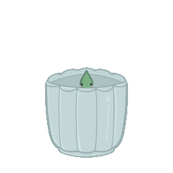
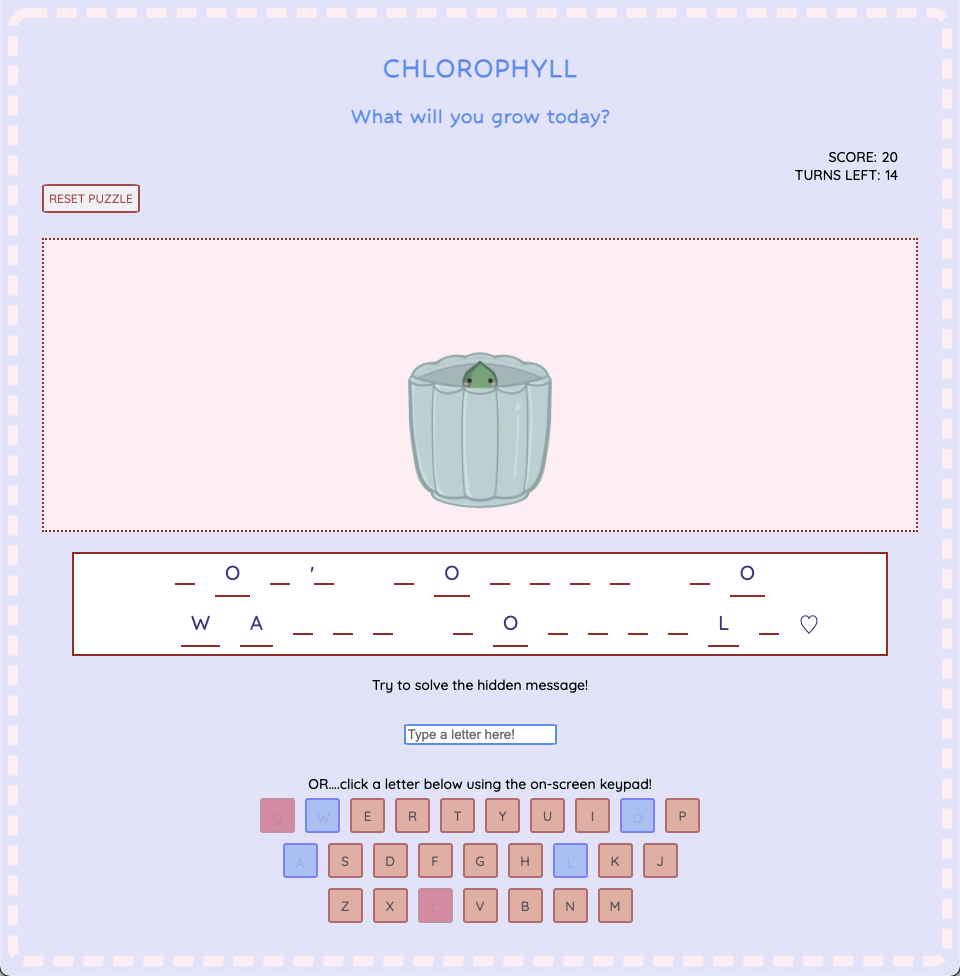
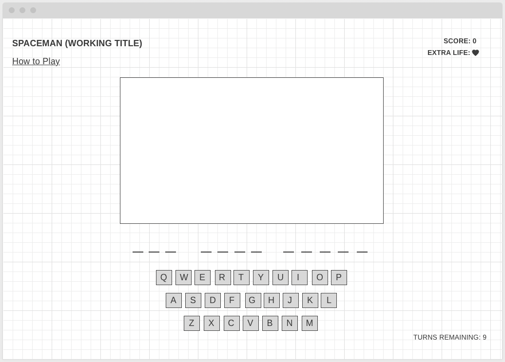
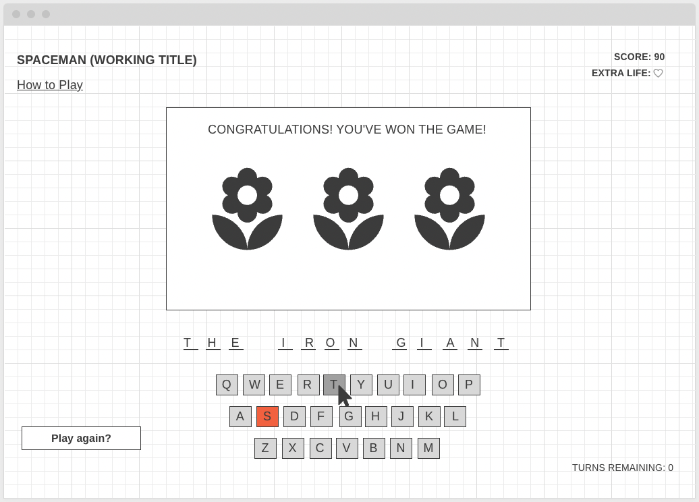

# ⚘ Chlorophyll ⚘
***(based on the hit game Spaceman)***

**Have you ever wanted to grow your own plant, but lack a green thumb? Look no further than this virtual plant simulator. Grow your own plant --- if you can solve some puzzles!**

## Sneak Peek

## Process Workflow
### 🌱 Initial Wireframes

 

> 🌸 Initially, my goal was to create a more interactive experience of the traditional "Spaceman" game. I want the player to feel like the choices they make are meaningful and that game progression isn't just linear.  
>
>> Some stretch goals included being able to reward the player with "power-ups" if they've answered correct responses in succession. I also wanted to experiment with varying ways that the player could interact with the game (on-screen keypad vs external keyboard).

### 🌱 Technical Approach
#### Technologies utilized:
- **Control flow:** Conditionals, loops, truthy/falsey values
    - Conditionals are the core structure of *Chlorophyll*. If-statements check if specific conditions are met that will cause elements on-screen to update based on the player's input.
- **DOM manipulation**
    - Directly manipulating existing elements based on user input.
- **Event listeners:** Click, keydown
    - Implementing varying event listeners added to ways that the player can interact with the interace.
- **User input**
    - Your choices matter! The player's direct input affects many elements of the game (including disabling buttons and how much your plant grows).

### 🌱 User stories
- My users are looking for a spin on a traditional game. They want to receive clear visuals that indicate how they're performing throughout the game. 
- They are looking for an immersive, accessible experience and the ability to interact with an interface in varying ways. 
- And, of course, my users are aspiring (or current) plant parents. ⚘⚘⚘

### 🌱 Challenges I Faced
I thoroughly enjoyed the whole course of the project- from planning out my schedule to brainstorming ideas before touching my code. Despite planning out my work, I found myself running into a few obstacles:
- **Time:** While I was able to complete my MVP, I really wanted to implement the ability for the user to obtain power-ups (along with other features), but this will be a project for a future date!
- **Cleanliness:** My current code achieves the minimum experience that I would like the player to have; however, I believe there are steps I could've taken to simplify my process and overall make for cleaner code.
- **Technical:** Currently, there is no way for buttons to disable after letters have been selected on an external keyboard. I am unsure of a potential way to link external keyboard input to on-screen buttons without needing to create a new set of variables.  
I would also like to revisit the score system so that the score cannot go lower than '0'. The inner HTML of the score-tracking elements currently displays 0 until the player achieves a higher score (to avoid a negative value displaying on-screen). This will require additional conditions, which I unfortunately ran out of time to incorporate.

### ✨ Like what you see? Check out the game [*here!*](https://chamomiletay.github.io/spaceman/)✨